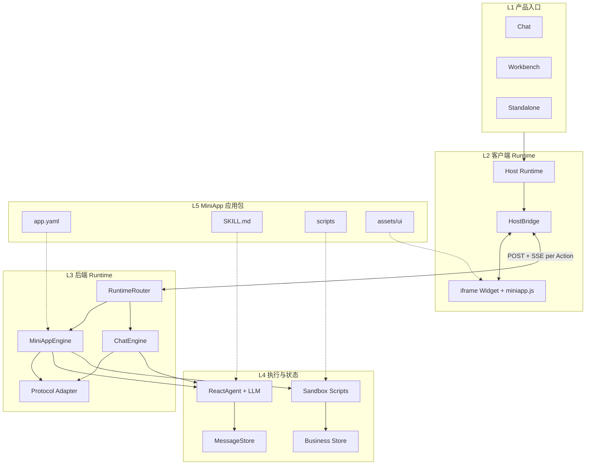
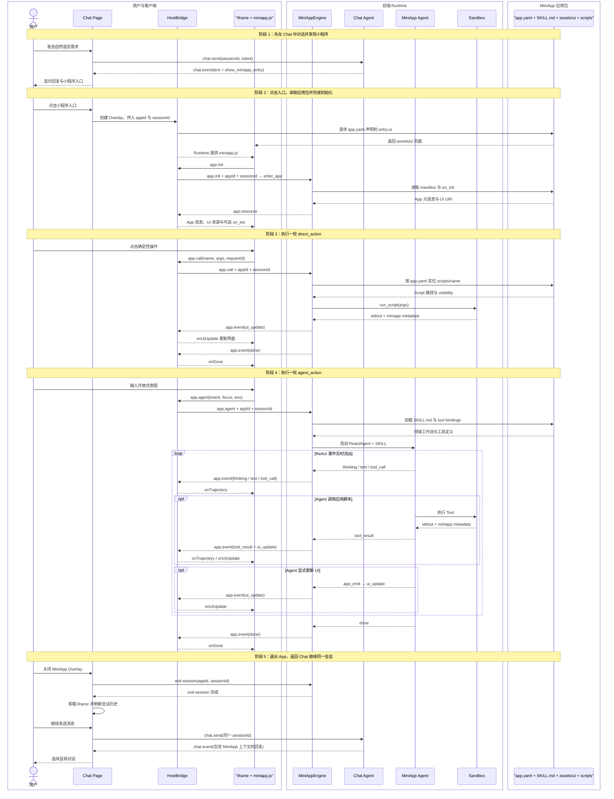

# MiniApp 技术架构图

## 1. 系统分层



### 分层含义

| 层级 | 主要职责 |
|---|---|
| L1 产品入口 | 提供 Chat、开发工作台和独立页面三种入口 |
| L2 客户端 Runtime | 承载 iframe，并桥接 Widget 与后端 |
| L3 后端 Runtime | 路由请求，编排 Chat 与 MiniApp，统一事件协议 |
| L4 执行与状态 | 执行 Agent 或 Script，保存对话与业务数据 |
| L5 MiniApp 应用包 | 声明领域知识、确定性能力与专用 UI |

## 2. 一次 Action 的运行时序



## 3. 两个核心边界

### Widget 与 Host

```text
iframe 内：miniapp.js
    ↕ postMessage
宿主内：HostBridge
```

`miniapp.js` 为小程序提供调用 API；`HostBridge` 负责 session、路由、权限和后端连接。

### Agent 与 UI

```text
Agent / Script
    → miniapp metadata / app_emit
    → ui_update
    → Widget 渲染
```

模型不直接修改 DOM。`structuredContent` 是 Agent、Script 与 UI 之间的稳定契约。脚本通过 `miniapp_runtime.emit_ui()` 写入 Tool Result metadata，而不是把 UI 协议塞进 stdout。
