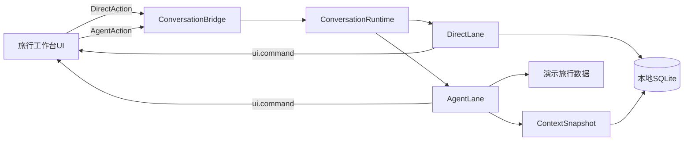

# 旅行助手 UI 小程序设计

## 1. 目标

将 `travelassistant-1.0.0.zip` 从纯 Chat Skill 改造成基于 app-skill v0.4 的 UI-first 旅行规划小程序。

首版目标：

- 用轻量向导完成旅行与同行人资料录入。
- 将原 Skill 的长篇报告拆成可导航、可局部更新的工作台模块。
- 表单、导航、清单等确定性操作使用 Direct Action。
- 旅行方案生成、风险分析和局部重规划使用 Agent Action。
- 桌面端使用右栏规划工作台，竖屏端重组为单列移动界面。
- 健康档案持久化到本地 SQLite，支持跳过、折叠和删除。
- 使用稳定的演示数据跑通协议与体验，不接入实时旅游数据源。

首版不包含实时定位、系统通知、动态改签、真实酒店库存与实时票价。

## 2. 产品体验

### 2.1 核心形态

采用“向导 + 工作台”：

1. 首次进入时完成四步向导。
2. 生成旅行方案后进入长期可编辑的规划工作台。
3. 用户可通过 Chat 或 UI 发起 Agent Action。
4. 工作台始终展示结构化结果，Chat 只保留解释、承接与追问。

四步向导：

1. 建立旅行：目的地、日期、出发地、预算。
2. 选择旅客：复用本地档案或新建同行人。
3. 确认偏好：旅行节奏、兴趣、饮食与住宿偏好。
4. 生成方案：确认摘要并发起 Agent Action。

### 2.2 工作台模块

- 旅行概览
- 每日行程
- 天气与穿衣
- 景点与美食
- 交通与住宿
- 健康与安全
- 行李清单

每个模块展示独立状态：

- `empty`：信息不足，引导补充资料。
- `generating`：显示骨架屏和取消入口。
- `ready`：展示内容，可局部编辑或重生成。
- `stale`：提示演示数据版本或资料变更导致内容过期。
- `failed`：保留旧版本并提供重试。

## 3. 响应式设计

### 3.1 桌面端

桌面端作为 Chat 右栏工具面：

- 顶部：旅行名称、日期、保存状态、全局生成操作。
- 左侧：七个工作台模块导航。
- 中部：当前模块主内容。
- 右侧或内容内：推荐理由、风险和关联提醒。

### 3.2 竖屏端

竖屏端不是桌面版缩放，而是重新编排为单列：

- 顶部：旅行摘要与更多操作。
- 主内容：当前模块的单列卡片。
- 底部固定四导航：`概览`、`行程`、`清单`、`我的`。
- 天气、景点、交通、住宿、健康等作为概览或行程内的二级模块。
- AI 操作收敛为页面底部主按钮或固定操作入口。

所有可点击控件的最小触控高度为 44px。健康敏感字段默认折叠。

## 4. 架构

### 4.1 Skill 包结构

```text
miniapp_demo/apps/travel-assistant/
├── app.yaml
├── SKILL.md
├── assets/
│   ├── ui/index.html
│   ├── data/demo_travel_data.json
│   └── schema/travel.sql
├── scripts/
│   ├── trip_store.py
│   ├── traveler_actions.py
│   ├── trip_actions.py
│   ├── luggage_actions.py
│   └── context_snapshot.py
└── references/
    ├── 健康评估.md
    ├── 季节目的地指南.md
    ├── 穿衣指南.md
    └── 行李清单.md
```

`SKILL.md` 保留现有旅行领域知识，但改写工作流：

- 不再通过 Chat 逐项收集所有字段。
- 优先打开旅行工作台。
- 从 Snapshot 的 Business Context 获取权威旅行资料。
- 模块化输出 `ui.command`，避免在 Chat 重复完整报告。
- 只在缺失关键信息时追问。

### 4.2 系统边界



Conversation 事件与业务数据保持分离：

- Conversation Event Store 保存 Action 与 SSE 事件。
- SQLite 按 `user × skill` 保存旅客、旅行草稿和生成模块。
- Direct Action 的字段级修改不进入 Agent Context。
- Agent 出队时通过 Snapshot 投影读取权威业务上下文。

## 5. Action 设计

### 5.1 Direct Action

Direct Action 用于低延迟、确定性操作：

- `create_trip`
- `update_trip`
- `delete_trip`
- `create_traveler`
- `update_traveler`
- `delete_traveler`
- `attach_traveler`
- `detach_traveler`
- `set_preferences`
- `confirm_trip_input`
- `toggle_luggage_item`
- `add_luggage_item`
- `remove_luggage_item`

Direct Action 完成后：

1. 校验 `expectedRevision`。
2. 在 SQLite 事务内更新数据。
3. 增加业务 revision。
4. 发送 `ui.command patch`。

Direct Action 不负责生成旅行建议，也不唤醒 Agent。

### 5.2 Agent Action

Agent Action 用于推理与结构化内容生成：

- 生成完整旅行方案。
- 重新规划某一天。
- 替换不适合的景点或餐饮。
- 根据健康档案调整建议。
- 重新生成天气穿衣、健康安全或行李模块。

Agent Action 必须携带用户自然语言 intent。Agent 从 Business Context 获取：

- 当前 `tripId`
- 旅行基础信息
- 已选择的旅客及必要健康摘要
- 用户偏好
- 当前模块状态与 revision
- 当前 route 和选中日期

## 6. Snapshot 与 UI Command

### 6.1 View Snapshot

UI 通过 `miniapp.setEnv()` 提供最小视图状态：

```json
{
  "tripId": "trip_123",
  "activeSection": "itinerary",
  "selectedDay": 2,
  "wizardStep": null,
  "dialog": null
}
```

不将完整旅客档案或旅行报告放入 View Snapshot。`context_snapshot.py` 使用 `tripId` 从 SQLite 读取权威数据并生成 Business Context。

### 6.2 UI Command

- `open`：打开旅行工作台。
- `navigate`：切换工作台模块、日期或向导步骤。
- `show_content`：首次加载完整旅行或模块内容。
- `patch`：更新单个模块、保存状态、revision 或清单项。
- `close`：关闭工作台。

模块生成结果使用稳定结构，而不是任意 HTML：

```json
{
  "tripId": "trip_123",
  "module": "itinerary",
  "status": "ready",
  "revision": 4,
  "content": {
    "days": []
  }
}
```

## 7. SQLite 数据模型

### 7.1 核心表

`travelers`

- `id`
- `display_name`
- `age_group`
- `gender`
- `mobility_notes`
- `health_notes`
- `medication_notes`
- `allergies_json`
- `temperature_preference`
- `created_at`
- `updated_at`

`trips`

- `id`
- `title`
- `origin`
- `destinations_json`
- `start_date`
- `end_date`
- `budget_amount`
- `budget_currency`
- `pace`
- `preferences_json`
- `status`
- `revision`
- `created_at`
- `updated_at`

`trip_travelers`

- `trip_id`
- `traveler_id`

`trip_modules`

- `trip_id`
- `module`
- `status`
- `content_json`
- `source_mode`
- `source_updated_at`
- `revision`
- `updated_at`

`luggage_items`

- `id`
- `trip_id`
- `category`
- `label`
- `quantity`
- `checked`
- `source`
- `revision`

### 7.2 隐私边界

- SQLite 仅保存在本地业务 Store。
- 敏感字段可跳过，不阻塞普通旅行规划。
- UI 默认折叠健康、用药和过敏详情。
- 支持删除单个旅客档案及其健康信息。
- 删除旅行不自动删除可复用旅客；删除旅客需明确确认。
- Agent Context 只投影与当前旅行相关的必要健康摘要。

## 8. 演示数据

首版不接实时搜索。Agent 使用：

- 原 Skill 的四份 reference 文档。
- `demo_travel_data.json` 中预置的目的地、天气、景点、交通、住宿和美食数据。

UI 必须标注：

- “演示数据”
- 数据对应的模拟日期或版本
- 不用于真实预订或医疗决策

演示数据适配器与未来实时搜索适配器使用相同的模块输出结构，避免后续重写 UI。

## 9. 错误处理

- 资料不完整：不启动 Agent，定位缺失字段并保留草稿。
- Agent 失败：保留已生成旧版本，当前模块标记失败并提供重试。
- `STALE_UI_REVISION`：重新读取 SQLite 权威状态并提示用户重试。
- SSE 断线：按 `conversationSeq` 重连重放，恢复 loading 和 Action 状态。
- Action 取消：保留已完成模块，当前生成模块恢复到旧版本或空状态。
- SQLite 写入失败：事务回滚，不发送成功 patch。
- 演示目的地无数据：明确提示当前不支持，不由模型编造实时信息。

## 10. 前置集成

旅行助手依赖 v0.4 主链路可用。实施前需确认：

- 后端注册 `conversations_router`。
- `ChatPage` 接入 `SkillPanel` 与 Conversation SSE。
- `miniapp.js` 支持 `host.ui_command`、`getEnv` 和 `host.loading`。
- Runtime 校验 `expectedRevision`。
- Agent 与 Direct 脚本使用一致的 `user × skill` Business Store。

这些属于协议落地前置工作，不应在旅行 Skill 内重复实现。

## 11. 测试与验收

### 11.1 自动化测试

- SQLite CRUD、事务回滚和删除语义。
- Direct Action 参数校验与 revision 冲突。
- View Snapshot 到 Business Context 的投影。
- Agent 模块输出 schema 校验。
- Action、SSE、取消和断线重放集成测试。
- 桌面与竖屏状态映射测试。

### 11.2 MVP 验收

1. 用户可在四步内完成旅行资料录入。
2. 用户可复用 SQLite 中已有旅客档案。
3. Agent 可生成七个工作台模块。
4. 用户可只重规划选定日期，不覆盖其他模块。
5. 表单与清单操作不调用 LLM。
6. 桌面侧栏和竖屏底部导航展示同一份数据。
7. 刷新页面后可从 SQLite 恢复旅行和模块状态。
8. 失败、取消或 SSE 重连不会丢失已有结果。
9. 用户可删除本地健康档案。
10. 所有模拟旅游信息均明确标注为演示数据。

